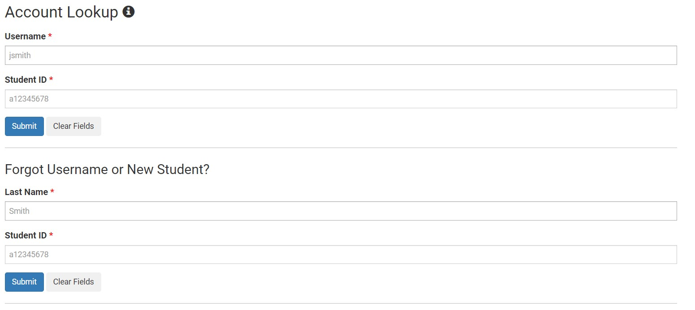
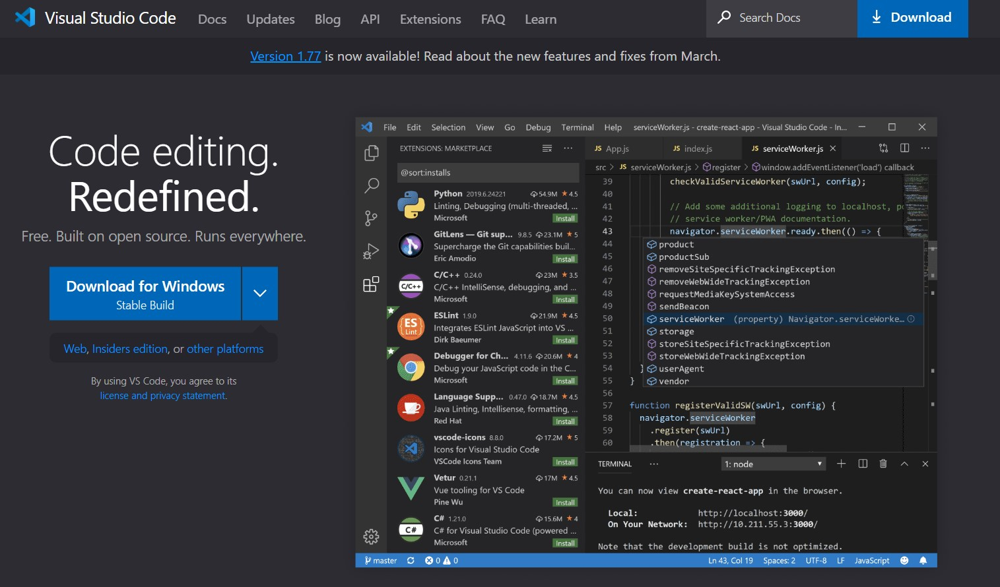
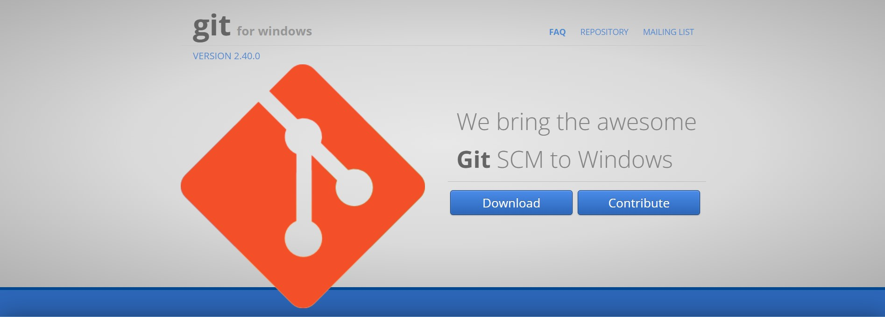
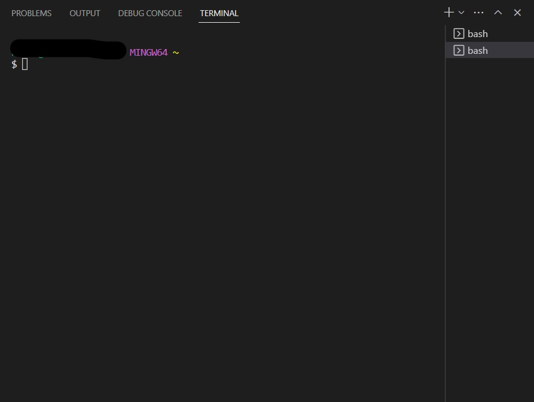
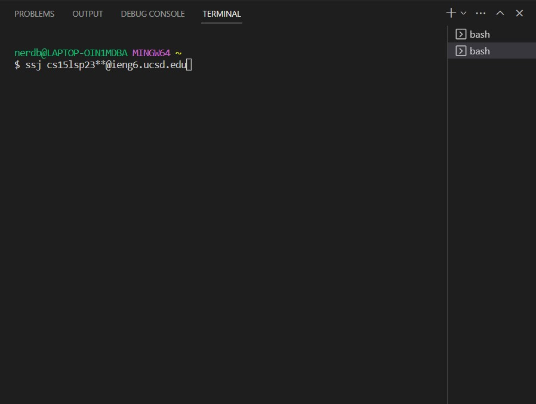
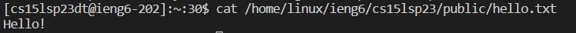
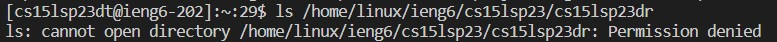

Step 1: reset your password/find your specific account name

  I. Login to find your account name [here](https://sdacs.ucsd.edu/~icc/index.php) 
  
  II. Reset your password from account lookup
  
  III. Wait a few hours for password reset to take place, can take up to 12 hours to initiate new password
  
  IV. 

Step 2: download/install visual studio code

  I. download visual studio code for windows [here](https://code.visualstudio.com/) 
  
  II. Once downlaoded, run the installer to setup vs code.
  
  III. At this point it should look like this 
  
  IV. download the vsc coding pack for java [here](https://code.visualstudio.com/docs/languages/java) 
  
Step 3: install Git

  I. download git for windows [here](https://gitforwindows.org/) 
  
  II. Once downlaoded, run the installer to setup git
  
  III. At this point it should look like this 

Step 4: set bash as the default terminal in visual studio code

  I. Open visual studio code and open up a new terminal by clicking "terminal" and "new terminal"
  
  II. Open the command palette by pressing ctrl + shift + p and type "Select Default Profile"
  
  III. Select "Git Bash" From the options that appear
  
  IV. CLick on the plus icon in the window to open a new terminal which will be using bash
     
  V.  (note additional line of commands not needed until step 5).

Step 5: connect to the assigned cse basement computer by ssh'ing your course username and inputting commands

  I. once selected, access the terminal and then input the following
     `ssh cs15lsp23zz@ieng6.ucsd.edu`
     but replace the zz with the corresponding letters in your CSE15l course specific account name
     
  II. If this is your first time logging in, select yes when asked if you want to continue connecting
  
  III. Input the password you selected as your reset password in step 1 II.
  
  IV. 
  
  V. If you did not notice it originally, pay attention as the example image displays a type, it should be ssh NOT ssj
  
  VI. use commands such as
     
     `cat /home/linux/ieng6/cs15lsp23/public/hello.txt`
     
     `cp /home/linux/ieng6/cs15lsp23/public/hello.txt`
     
     `ls <directory>` where <directory> is /home/linux/ieng6/cs15lsp23/cs15lsp23abc, where the
      abc corresponds to another user's course specific ID tag
     
      these commands will allow you to navigate and interface with both your own commuter, and         the lab computer for which you have been assigned.  
