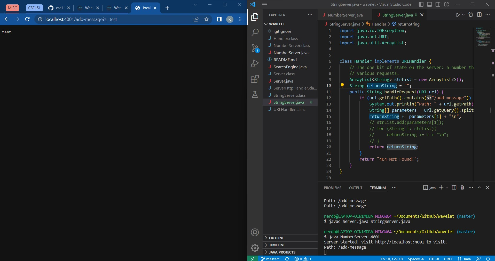

    import java.io.IOException;
    import java.net.URI;
    import java.util.ArrayList;
    class Handler implements URLHandler {
        // The one bit of state on the server: a number that will be manipulated by
        // various requests.
        ArrayList<String> strList = new ArrayList<>();
        String returnString = "";
        public String handleRequest(URI url) {
            if (url.getPath().contains("/add-message")) {
                System.out.println("Path: " + url.getPath());
                String[] parameters = url.getQuery().split("=");
                returnString += parameters[1] + "\n";
                return returnString;
            }
            return "404 Not Found!";
        }
    }
    class StringServer {
        public static void main(String[] args) throws IOException {
            if(args.length == 0){
                System.out.println("Missing port number! Try any number between 1024 to 49151");
                return;
            }
            int port = Integer.parseInt(args[0]);
            Server.start(port, new Handler());
        }
    }

Methods being called:

--The main method to take my port number

--The handleRequest method that takes my specific add-message path and the String with it

Relevant method arguments and fields:

--The add-message argument is relevant as it is the correct command for the path as well as the string coming after the equals sign as that is what is displayed

--The returnString field is relevant as it is what is actually added into by the parameters array index 1, and what is displayed

Class field values changed by request:

-- The values that were changed were the URI as it was modified to accept an "argument" which was whatever String we wanted added to the displya, as well as the returnString field which was previously discussed.

Methods being called:

--The main method to take my port number

--The handleRequest method that takes my specific add-message path and the String with it

Relevant method arguments and fields:

--The add-message argument is relevant as it is the correct command for the path as well as the string coming after the equals sign as that is what is displayed

--The returnString field is relevant as it is what is actually added into by the parameters array index 1, and what is displayed

Class field values changed by request:

-- The values that were changed were the URI as it was modified to accept an "argument" which was whatever String we wanted added to the displya, as well as the returnString field which was previously discussed.
